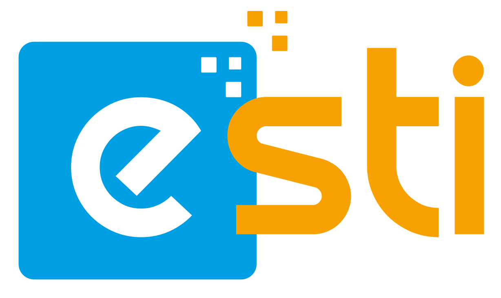

# ESTI UNOFFICIAL LOGO REDESIGN

## Tools Used

- [Inkscape](https://inkscape.org/) (vector graphics editor)

## Comparison

|                                              Old Logo                                              |                                             New Logo                                              |
| :------------------------------------------------------------------------------------------------: | :-----------------------------------------------------------------------------------------------: |
|    _Original ESTI Logo_ |    _Redesigned Unofficial Logo_ |
|           _Original ESTI Logo_        |           _Redesigned Unofficial Logo_        |

## Download

- [Source SVG File](./esti.svg)
- [Full Lockup PNG](./build/esti_full-lockup-logo.png)
- [Icon Only PNG](./build/esti_icon-logo.png)

---

> **Disclaimer:**  
> This logo redesign is unofficial and created for educational purposes only. It is not intended to replace the official ESTI logo, but may be used in personal projects where an alternative is desired.
